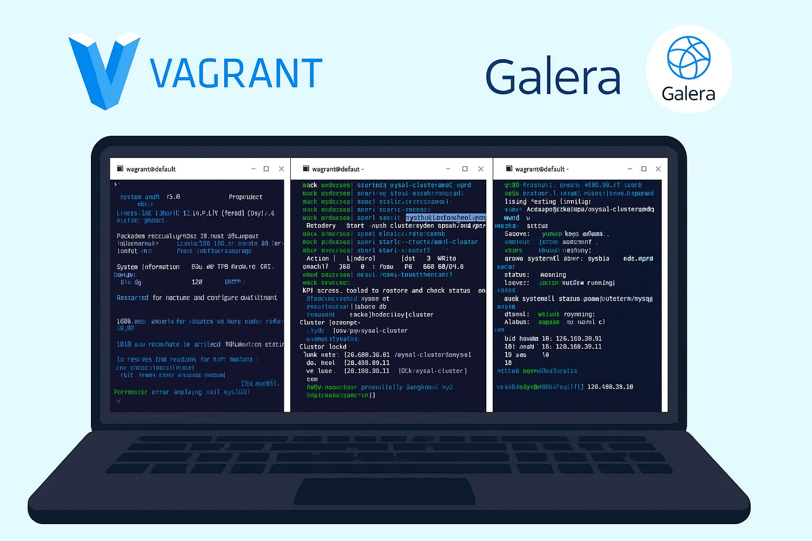
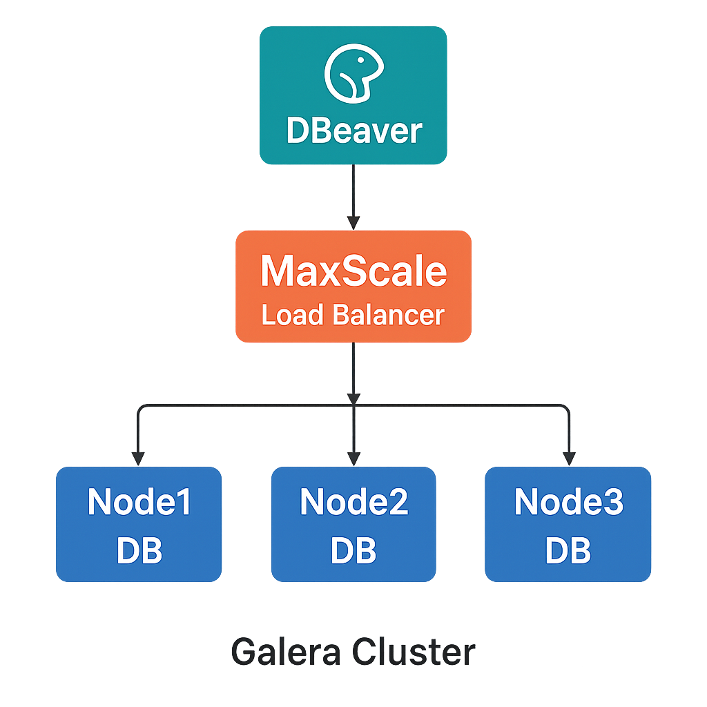

### Instalasi dan Implementasi MaxScale Galera Cluster dengan DBeaver

 

selamat mencoba dan mengerjakan

---

## 📌 Deskripsi Proyek
Proyek ini bertujuan untuk mengimplementasikan **MariaDB Galera Cluster** dengan **MaxScale** sebagai load balancer, serta melakukan eksplorasi data menggunakan **DBeaver** sebagai Database Client.  
Teknologi ini digunakan untuk menciptakan **High Availability** pada sistem basis data dengan replikasi **multi-master**, sehingga setiap node dapat membaca dan menulis data secara sinkron.

---

## 🛠️ Teknologi yang Digunakan
       

---

## 📂 Arsitektur Proyek

